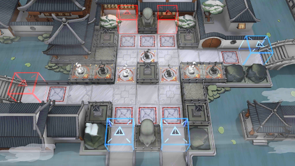

# 关卡一览————WR-6

## 关卡一览

关卡编号: WR-6

关卡名称: 画中

目标点生命值: 3

敌人总数: 34

理智消耗: 12

## 关卡地图

## 敌人情况

| 敌人图片 | 敌人名称 | 数量  |
|---------|-----|-----|
| ./eneIcons/eneIcons/¡°¶Ê¡±.png| “妒”  |   2  |
| ./eneIcons/eneIcons/¡°Ð¡Ôꡱ.png| “小躁”  |   30  |
| ./eneIcons/eneIcons/¡°ÕÚÄ¿¡±.png| “遮目”  |   2  |
