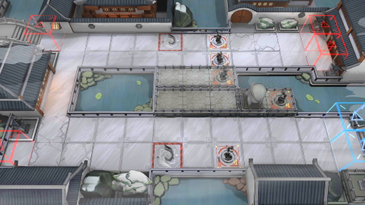

# 关卡一览————WR-8

## 关卡一览

关卡编号: WR-8

关卡名称: 大梦

目标点生命值: 3

敌人总数: 57

理智消耗: 15

## 关卡地图

## 敌人情况

| 敌人图片 | 敌人名称 | 数量  |
|---------|-----|-----|
| ./eneIcons/eneIcons/¡°°¢Ò§¡±.png| “阿咬”  |   2  |
| ./eneIcons/eneIcons/¡°µÃÒ⡱.png| “得意”  |   47  |
| ./eneIcons/eneIcons/¡°ÍµÏС±.png| “偷闲”  |   2  |
| ./eneIcons/eneIcons/¡°Ð¡Ôꡱ.png| “小躁”  |   6  |
