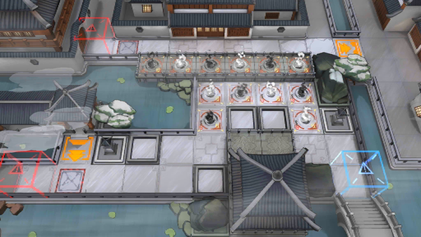

# 关卡一览————WR-EX-2

## 关卡一览

关卡编号: WR-EX-2

关卡名称: 妒恨

目标点生命值: 3

敌人总数: 34

理智消耗: 10

## 关卡地图

## 敌人情况

| 敌人图片 | 敌人名称 | 数量  |
|---------|-----|-----|
| ./eneIcons/eneIcons/¸´Ôӵġ°¶Ê¡±.png| 复杂的“妒”  |   4  |
| ./eneIcons/eneIcons/½¹¼±µÄ¡°Ð¡Ôꡱ.png| 焦急的“小躁”  |   13  |
| ./eneIcons/eneIcons/ÈÏÕæµÄ¡°°¢Ò§¡±.png| 认真的“阿咬”  |   15  |
| ./eneIcons/eneIcons/ÎÞġ°Ê¢Å­¡±.png| 无羁的“盛怒”  |   2  |
