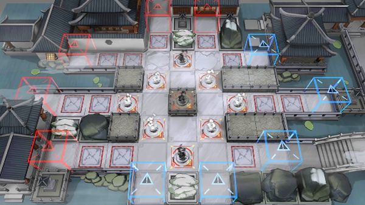

# 关卡一览————WR-EX-3

## 关卡一览

关卡编号: WR-EX-3

关卡名称: 阵法

目标点生命值: 3

敌人总数: 30

理智消耗: 15

## 关卡地图

## 敌人情况

| 敌人图片 | 敌人名称 | 数量  |
|---------|-----|-----|
| ./eneIcons/eneIcons/²»¶¯µÄ¡°ÍµÏС±.png| 不动的“偷闲”  |   1  |
| ./eneIcons/eneIcons/²»ÐªµÄ¡°ÕÚÄ¿¡±.png| 不歇的“遮目”  |   2  |
| ./eneIcons/eneIcons/»Ð㱵ġ°µÃÒ⡱.png| 恍惚的“得意”  |   7  |
| ./eneIcons/eneIcons/ÈÏÕæµÄ¡°°¢Ò§¡±.png| 认真的“阿咬”  |   20  |
