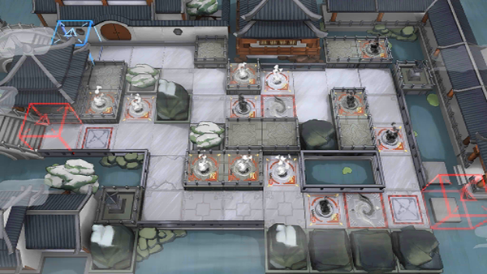

# 关卡一览————WR-EX-5

## 关卡一览

关卡编号: WR-EX-5

关卡名称: 栈道

目标点生命值: 3

敌人总数: 37

理智消耗: 15

## 关卡地图

## 敌人情况

| 敌人图片 | 敌人名称 | 数量  |
|---------|-----|-----|
| ./eneIcons/eneIcons/²»ÐªµÄ¡°ÕÚÄ¿¡±.png| 不歇的“遮目”  |   3  |
| ./eneIcons/eneIcons/¸´Ôӵġ°¶Ê¡±.png| 复杂的“妒”  |   3  |
| ./eneIcons/eneIcons/½¹¼±µÄ¡°Ð¡Ôꡱ.png| 焦急的“小躁”  |   10  |
| ./eneIcons/eneIcons/ÈÏÕæµÄ¡°°¢Ò§¡±.png| 认真的“阿咬”  |   12  |
| ./eneIcons/eneIcons/Óػصġ°Ø°ÏÖ¡±.png| 迂回的“匕现”  |   9  |
