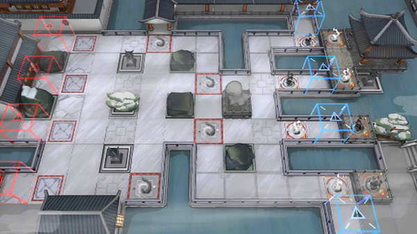

# 关卡一览————WR-EX-6

## 关卡一览

关卡编号: WR-EX-6

关卡名称: 当关

目标点生命值: 3

敌人总数: 50

理智消耗: 15

## 关卡地图

## 敌人情况

| 敌人图片 | 敌人名称 | 数量  |
|---------|-----|-----|
| ./eneIcons/eneIcons/¡°ÕÚÄ¿¡±.png| “遮目”  |   24  |
| ./eneIcons/eneIcons/²»ÐªµÄ¡°ÕÚÄ¿¡±.png| 不歇的“遮目”  |   12  |
| ./eneIcons/eneIcons/½¹¼±µÄ¡°Ð¡Ôꡱ.png| 焦急的“小躁”  |   14  |
