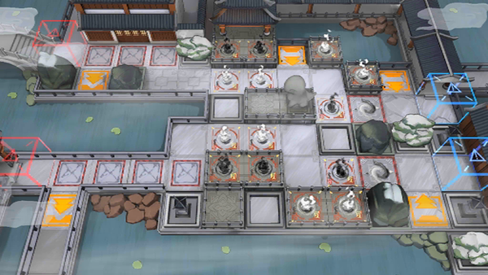

# 关卡一览————WR-EX-7

## 关卡一览

关卡编号: WR-EX-7

关卡名称: 迷途

目标点生命值: 3

敌人总数: 29

理智消耗: 20

## 关卡地图

## 敌人情况

| 敌人图片 | 敌人名称 | 数量  |
|---------|-----|-----|
| ./eneIcons/eneIcons/²»ÐªµÄ¡°ÕÚÄ¿¡±.png| 不歇的“遮目”  |   6  |
| ./eneIcons/eneIcons/½¹¼±µÄ¡°Ð¡Ôꡱ.png| 焦急的“小躁”  |   11  |
| ./eneIcons/eneIcons/ÈÏÕæµÄ¡°°¢Ò§¡±.png| 认真的“阿咬”  |   7  |
| ./eneIcons/eneIcons/ÎÞġ°Ê¢Å­¡±.png| 无羁的“盛怒”  |   5  |
