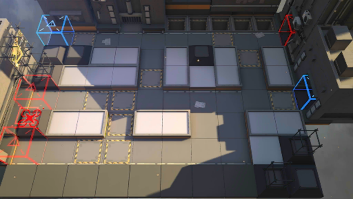

# 关卡一览————乌萨斯_切尔诺伯格

## 关卡一览

关卡编号: 乌萨斯_切尔诺伯格

关卡名称: 切尔诺伯格

目标点生命值: 10

敌人总数: 400

理智消耗: 20

## 关卡地图

## 敌人情况

| 敌人图片 | 敌人名称 | 数量  |
|---------|-----|-----|
| ./eneIcons/eneIcons/±©ÂÒ·Ö×Ó.png| 暴乱分子  |   21  |
| ./eneIcons/eneIcons/·¥Ä¾»ú.png| 伐木机  |   16  |
| ./eneIcons/eneIcons/¸ß½×Êõʦ.png| 高阶术师  |   10  |
| ./eneIcons/eneIcons/»ú¶¯¶Ü±ø.png| 机动盾兵  |   20  |
| ./eneIcons/eneIcons/¼¦Î²¾ÆͶÖÀÕß.png| 鸡尾酒投掷者  |   43  |
| ./eneIcons/eneIcons/ÁÔ¹·.png| 猎狗  |   13  |
| ./eneIcons/eneIcons/ÁÔ¹·pro.png| 猎狗pro  |   17  |
| ./eneIcons/eneIcons/åóÊÖ.png| 弩手  |   4  |
| ./eneIcons/eneIcons/åóÊÖ×鳤.png| 弩手组长  |   2  |
| ./eneIcons/eneIcons/ȼÉÕƿͶÖÀÕß.png| 燃烧瓶投掷者  |   14  |
| ./eneIcons/eneIcons/Ê°»ÄÕß.png| 拾荒者  |   20  |
| ./eneIcons/eneIcons/Ê¿±ø.png| 士兵  |   62  |
| ./eneIcons/eneIcons/ß±¾ýÕß.png| 弑君者  |   1  |
| ./eneIcons/eneIcons/Êõʦ.png| 术师  |   13  |
| ./eneIcons/eneIcons/Êõʦ×鳤.png| 术师组长  |   8  |
| ./eneIcons/eneIcons/Ñý¹Ö.png| 妖怪  |   20  |
| ./eneIcons/eneIcons/Դʯ³æ.png| 源石虫  |   62  |
| ./eneIcons/eneIcons/Դʯ³æ¡¤¦Á.png| 源石虫·α  |   47  |
| ./eneIcons/eneIcons/ÖØ×°·ÀÓùÕß.png| 重装防御者  |   7  |
