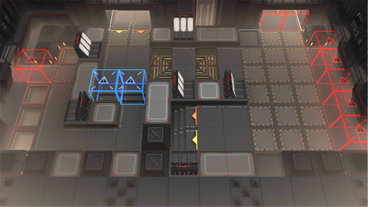

# 关卡一览————哥伦比亚_南方监狱

## 关卡一览

关卡编号: 哥伦比亚_南方监狱

关卡名称: 南方监狱

目标点生命值: 10

敌人总数: 400

理智消耗: 25

## 关卡地图

## 敌人情况

| 敌人图片 | 敌人名称 | 数量  |
|---------|-----|-----|
| ./eneIcons/eneIcons/´«ÆæÖØ·¸.png| 传奇重犯  |   10  |
| ./eneIcons/eneIcons/½Ü˹¶Ù¡¤ÍþÁ®Ä·Ë¹.png| 杰斯顿·威廉姆斯  |   1  |
| ./eneIcons/eneIcons/¾«ÈñÎ÷Î÷ÀïÈË.png| 精锐西西里人  |   20  |
| ./eneIcons/eneIcons/¾ÞººÇô·¸.png| 巨汉囚犯  |   13  |
| ./eneIcons/eneIcons/ÀÏÁ·Çô·¸.png| 老练囚犯  |   36  |
| ./eneIcons/eneIcons/ÁÔ¹·pro.png| 猎狗pro  |   41  |
| ./eneIcons/eneIcons/ÆÕͨÇô·¸.png| 普通囚犯  |   32  |
| ./eneIcons/eneIcons/ǿ׳Çô·¸.png| 强壮囚犯  |   36  |
| ./eneIcons/eneIcons/ȭʦÇô·¸.png| 拳师囚犯  |   6  |
| ./eneIcons/eneIcons/È­ÊÖÇô·¸.png| 拳手囚犯  |   26  |
| ./eneIcons/eneIcons/ÉäÊÖÇô·¸.png| 射手囚犯  |   36  |
| ./eneIcons/eneIcons/ÉñÉäÊÖÇô·¸.png| 神射手囚犯  |   44  |
| ./eneIcons/eneIcons/ÊõʦÇô·¸.png| 术师囚犯  |   26  |
| ./eneIcons/eneIcons/ΣÏÕÊõʦÇô·¸.png| 危险术师囚犯  |   27  |
| ./eneIcons/eneIcons/Î÷Î÷ÀïÈË.png| 西西里人  |   36  |
| ./eneIcons/eneIcons/ÖØ·¸.png| 重犯  |   10  |
