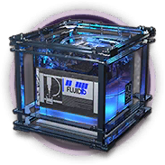

# 干员资料————布丁

## 干员信息

干员代号: 布丁

干员种族: 阿戈尔

干员公招标签: 远程位,术师,输出

## 干员技能

| 技能一       | 技能二   | 技能三 |
| ------------ | -------- | ------ |
| 战术咏唱·β型 | 扩散电流 | 无 |

## 材料需求

### 精英化

| 材料名称      | 材料图片 | 数量  |
|---------|---------|-----|
| RMA70-12 |   |   11  |
| 切削原液 |   |   3  |
| 术师芯片 |   |   3  |
| 术师芯片组 |   |   5  |
| 糖 |   |   1  |
| 酮凝集 |   |   1  |

### 技能1→7

| 材料名称      | 材料图片 | 数量  |
|---------|---------|-----|
| RMA70-12 |   |   2  |
| 技巧概要·卷1 |   |   4  |
| 技巧概要·卷2 |   |   9  |
| 技巧概要·卷3 |   |   4  |
| 晶体元件 |   |   3  |
| 聚酸酯 |   |   3  |
| 糖 |   |   2  |
| 源岩 |   |   5  |

### 技能专精

| 材料名称      | 材料图片 | 数量  |
|---------|---------|-----|
| RMA70-24 |   |   2  |
| 白马醇 |   |   2  |
| 改量装置 |   |   2  |
| 技巧概要·卷3 |   |   24  |
| 晶体电路 |   |   1  |
| 晶体电子单元 |   |   2  |
| 凝胶 |   |   4  |
| 切削原液 |   |   3  |
| 全新装置 |   |   2  |
| 酮阵列 |   |   2  |
| 异铁块 |   |   1  |

### 模组

| 材料名称      | 材料图片 | 数量  |
|---------|---------|-----|
| 模组数据块 |   |   1  |
| 全新装置 |   |   4  |
