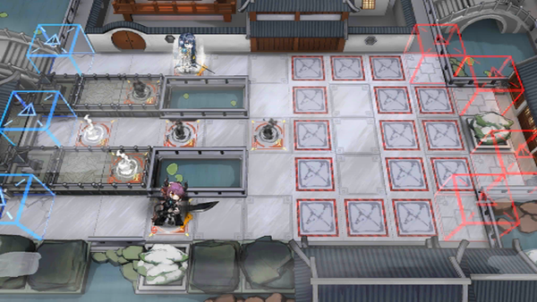

# 关卡一览————悖论模拟_“除夕”

## 关卡一览

关卡编号: 悖论模拟_“除夕”

关卡名称: “除夕”

目标点生命值: 1

敌人总数: 47

理智消耗: 0

## 关卡地图

## 敌人情况

| 敌人图片 | 敌人名称 | 数量  |
|---------|-----|-----|
| ./eneIcons/eneIcons/¡°µÃÒ⡱.png| “得意”  |   34  |
| ./eneIcons/eneIcons/¡°ÕÚÄ¿¡±.png| “遮目”  |   12  |
