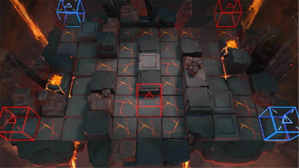

# 关卡一览————悖论模拟_一个人的包围圈

## 关卡一览

关卡编号: 悖论模拟_一个人的包围圈

关卡名称: 一个人的包围圈

目标点生命值: 1

敌人总数: 47

理智消耗: 0

## 关卡地图

## 敌人情况

| 敌人图片 | 敌人名称 | 数量  |
|---------|-----|-----|
| ./eneIcons/eneIcons/ÌáÑÇ¿¨ÎÚ¹Ú¾ü.png| 提亚卡乌冠军  |   5  |
| ./eneIcons/eneIcons/ÌáÑÇ¿¨ÎÚÆÆ»µÕß.png| 提亚卡乌破坏者  |   7  |
| ./eneIcons/eneIcons/ÌáÑÇ¿¨ÎÚÉñͶÊÖ.png| 提亚卡乌神投手  |   9  |
| ./eneIcons/eneIcons/ÌáÑÇ¿¨ÎÚÎÀÊ¿.png| 提亚卡乌卫士  |   26  |
