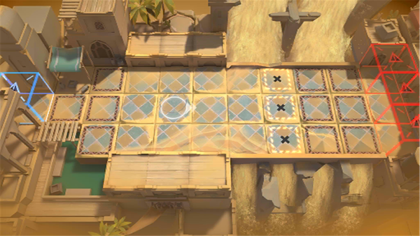

# 关卡一览————悖论模拟_一夫当关

## 关卡一览

关卡编号: 悖论模拟_一夫当关

关卡名称: 一夫当关

目标点生命值: 1

敌人总数: 46

理智消耗: 0

## 关卡地图

## 敌人情况

| 敌人图片 | 敌人名称 | 数量  |
|---------|-----|-----|
| ./eneIcons/eneIcons/±äÒìÑÒÖë.png| 变异岩蛛  |   5  |
| ./eneIcons/eneIcons/±äÒìÑÒÖë¦Á.png| 变异岩蛛α  |   2  |
| ./eneIcons/eneIcons/²½±ø×鳤.png| 步兵组长  |   33  |
| ./eneIcons/eneIcons/»û±ä¶ñÐÔÁö.png| 畸变恶性瘤  |   0  |
| ./eneIcons/eneIcons/»û±ä׸ÉúÎï.png| 畸变赘生物  |   0  |
| ./eneIcons/eneIcons/Դʯ»û±äÌå¦Á.png| 源石畸变体α  |   6  |
