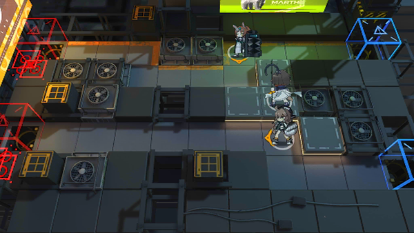

# 关卡一览————悖论模拟_万箭齐发

## 关卡一览

关卡编号: 悖论模拟_万箭齐发

关卡名称: 万箭齐发

目标点生命值: 1

敌人总数: 57

理智消耗: 0

## 关卡地图

## 敌人情况

| 敌人图片 | 敌人名称 | 数量  |
|---------|-----|-----|
| ./eneIcons/eneIcons/·¨Êõ´óʦA1.png| 法术大师A1  |   16  |
| ./eneIcons/eneIcons/Çá¼×ÎÀ±ø×鳤.png| 轻甲卫兵组长  |   2  |
| ./eneIcons/eneIcons/Ê¿±ø.png| 士兵  |   23  |
| ./eneIcons/eneIcons/Ñý¹Ö.png| 妖怪  |   8  |
| ./eneIcons/eneIcons/Ñý¹ÖMKII.png| 妖怪MKII  |   6  |
| ./eneIcons/eneIcons/Óù4.png| 御4  |   2  |
