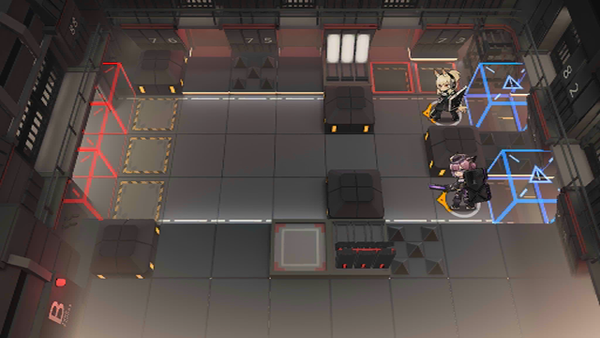

# 关卡一览————悖论模拟_不动如山

## 关卡一览

关卡编号: 悖论模拟_不动如山

关卡名称: 不动如山

目标点生命值: 1

敌人总数: 54

理智消耗: 0

## 关卡地图

## 敌人情况

| 敌人图片 | 敌人名称 | 数量  |
|---------|-----|-----|
| ./eneIcons/eneIcons/ÆÕͨÇô·¸.png| 普通囚犯  |   31  |
| ./eneIcons/eneIcons/ȭʦÇô·¸.png| 拳师囚犯  |   6  |
| ./eneIcons/eneIcons/È­ÊÖÇô·¸.png| 拳手囚犯  |   16  |
| ./eneIcons/eneIcons/ÊõʦÇô·¸.png| 术师囚犯  |   1  |
