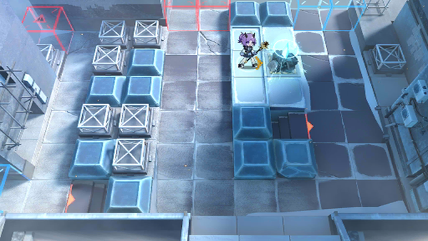

# 关卡一览————悖论模拟_不息

## 关卡一览

关卡编号: 悖论模拟_不息

关卡名称: 不息

目标点生命值: 1

敌人总数: 41

理智消耗: 0

## 关卡地图

## 敌人情况

| 敌人图片 | 敌人名称 | 数量  |
|---------|-----|-----|
| ./eneIcons/eneIcons/±ù±¬Ô´Ê¯³æ.png| 冰爆源石虫  |   11  |
| ./eneIcons/eneIcons/˪ÑÀ.png| 霜牙  |   8  |
| ./eneIcons/eneIcons/Ñ©¹Ö¾Ñ»÷ÊÖ.png| 雪怪狙击手  |   1  |
| ./eneIcons/eneIcons/Ñ©¹ÖС¶Ó.png| 雪怪小队  |   18  |
| ./eneIcons/eneIcons/Ñ©¹ÖС¶ÓÔä±ùÈË.png| 雪怪小队凿冰人  |   3  |
