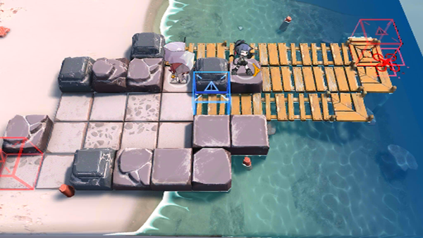

# 关卡一览————悖论模拟_业精于勤

## 关卡一览

关卡编号: 悖论模拟_业精于勤

关卡名称: 业精于勤

目标点生命值: 1

敌人总数: 27

理智消耗: 0

## 关卡地图

## 敌人情况

| 敌人图片 | 敌人名称 | 数量  |
|---------|-----|-----|
| ./eneIcons/eneIcons/±©û_¡¤G.png| 暴鸰·G  |   1  |
| ./eneIcons/eneIcons/ÅÍз.png| 磐蟹  |   5  |
| ./eneIcons/eneIcons/ÅÓ±´.png| 庞贝  |   1  |
| ./eneIcons/eneIcons/Ñý¹ÖMKII.png| 妖怪MKII  |   2  |
| ./eneIcons/eneIcons/Դʯ³æ.png| 源石虫  |   18  |
