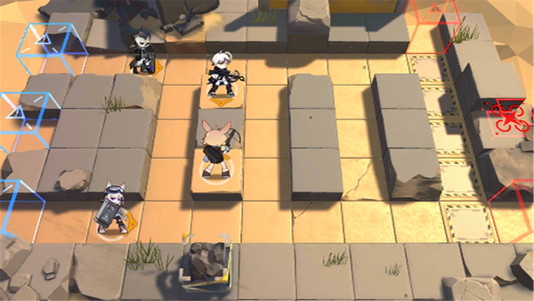

# 关卡一览————悖论模拟_东奔西走

## 关卡一览

关卡编号: 悖论模拟_东奔西走

关卡名称: 东奔西走

目标点生命值: 1

敌人总数: 13

理智消耗: 0

## 关卡地图

## 敌人情况

| 敌人图片 | 敌人名称 | 数量  |
|---------|-----|-----|
| ./eneIcons/eneIcons/±©û_¡¤G.png| 暴鸰·G  |   2  |
| ./eneIcons/eneIcons/·¨Êõ½üÎÀ.png| 法术近卫  |   4  |
| ./eneIcons/eneIcons/·´×°¼×²½±ø.png| 反装甲步兵  |   4  |
| ./eneIcons/eneIcons/Èø¿¨×È´©´ÌÊÖ×鳤.png| 萨卡兹穿刺手组长  |   3  |
