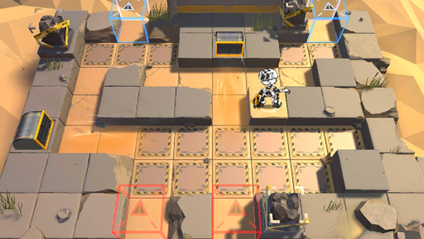

# 关卡一览————悖论模拟_乘风追击

## 关卡一览

关卡编号: 悖论模拟_乘风追击

关卡名称: 乘风追击

目标点生命值: 1

敌人总数: 84

理智消耗: 0

## 关卡地图

## 敌人情况

| 敌人图片 | 敌人名称 | 数量  |
|---------|-----|-----|
| ./eneIcons/eneIcons/»ÒβÏãÖ÷.png| 灰尾香主  |   2  |
| ./eneIcons/eneIcons/¾«¸É´òÊÖ.png| 精干打手  |   9  |
| ./eneIcons/eneIcons/ÓÄÁé×鳤.png| 幽灵组长  |   3  |
| ./eneIcons/eneIcons/Դʯ³æ¡¤¦Á.png| 源石虫·α  |   70  |
