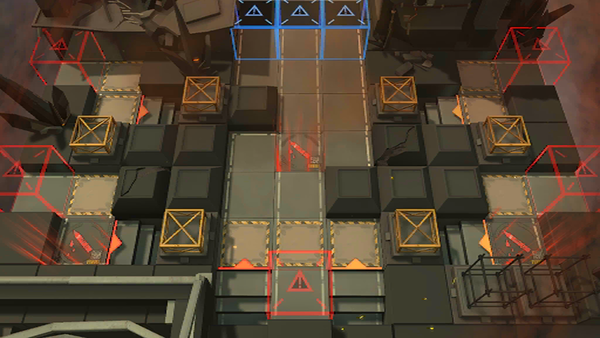

# 关卡一览————悖论模拟_伤痛坚守

## 关卡一览

关卡编号: 悖论模拟_伤痛坚守

关卡名称: 伤痛坚守

目标点生命值: 1

敌人总数: 32

理智消耗: 0

## 关卡地图

## 敌人情况

| 敌人图片 | 敌人名称 | 数量  |
|---------|-----|-----|
| ./eneIcons/eneIcons/±©Í½.png| 暴徒  |   16  |
| ./eneIcons/eneIcons/·¨Êõ½üÎÀ.png| 法术近卫  |   6  |
| ./eneIcons/eneIcons/·¨Êõ½üÎÀ×鳤.png| 法术近卫组长  |   1  |
| ./eneIcons/eneIcons/¸´³ðÕß.png| 复仇者  |   1  |
| ./eneIcons/eneIcons/Èø¿¨×È´ó½£ÊÖ.png| 萨卡兹大剑手  |   2  |
| ./eneIcons/eneIcons/Ñ°³ðÕß.png| 寻仇者  |   6  |
