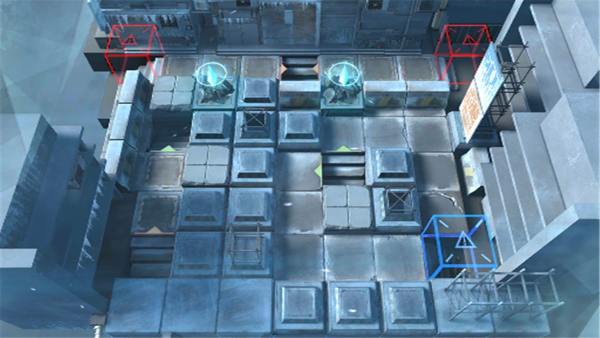

# 关卡一览————悖论模拟_别让自己冻僵

## 关卡一览

关卡编号: 悖论模拟_别让自己冻僵

关卡名称: 别让自己冻僵

目标点生命值: 1

敌人总数: 10

理智消耗: 0

## 关卡地图

## 敌人情况

| 敌人图片 | 敌人名称 | 数量  |
|---------|-----|-----|
| ./eneIcons/eneIcons/±ù±¬Ô´Ê¯³æ.png| 冰爆源石虫  |   6  |
| ./eneIcons/eneIcons/¿ñ±©ËÞÖ÷Ê¿±ø.png| 狂暴宿主士兵  |   2  |
| ./eneIcons/eneIcons/¿ñ±©ËÞÖ÷×鳤.png| 狂暴宿主组长  |   2  |
