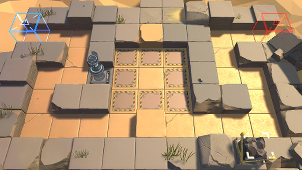

# 关卡一览————悖论模拟_制敌伏兵

## 关卡一览

关卡编号: 悖论模拟_制敌伏兵

关卡名称: 制敌伏兵

目标点生命值: 1

敌人总数: 65

理智消耗: 0

## 关卡地图

## 敌人情况

| 敌人图片 | 敌人名称 | 数量  |
|---------|-----|-----|
| ./eneIcons/eneIcons/ÅÚÊÖ.png| 炮手  |   4  |
| ./eneIcons/eneIcons/ÆÆÕóÕß.png| 破阵者  |   14  |
| ./eneIcons/eneIcons/DZ·üÕß.png| 潜伏者  |   13  |
| ./eneIcons/eneIcons/Èø¿¨×È´©´ÌÊÖ.png| 萨卡兹穿刺手  |   6  |
| ./eneIcons/eneIcons/ÓÄÁé.png| 幽灵  |   18  |
| ./eneIcons/eneIcons/ÓÄÁé×鳤.png| 幽灵组长  |   10  |
