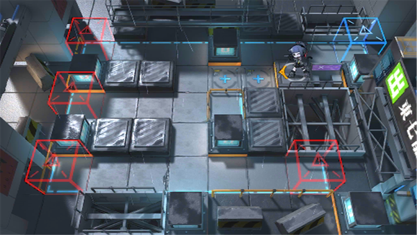

# 关卡一览————悖论模拟_削铁如泥

## 关卡一览

关卡编号: 悖论模拟_削铁如泥

关卡名称: 削铁如泥

目标点生命值: 1

敌人总数: 19

理智消耗: 0

## 关卡地图

## 敌人情况

| 敌人图片 | 敌人名称 | 数量  |
|---------|-----|-----|
| ./eneIcons/eneIcons/»Òβ.png| 灰尾  |   1  |
| ./eneIcons/eneIcons/»ÒβÏãÖ÷.png| 灰尾香主  |   2  |
| ./eneIcons/eneIcons/¾«¸É´òÊÖ.png| 精干打手  |   3  |
| ./eneIcons/eneIcons/¾«ÈñÎ÷Î÷ÀïÈË.png| 精锐西西里人  |   4  |
| ./eneIcons/eneIcons/Éî³ØÖؼ×ÎÀÊ¿¶Ó³¤.png| 深池重甲卫士队长  |   1  |
| ./eneIcons/eneIcons/ÊØĹʯÏñ.png| 守墓石像  |   1  |
| ./eneIcons/eneIcons/Ñý¹Ö.png| 妖怪  |   5  |
| ./eneIcons/eneIcons/Դʯ»û±äÌå.png| 源石畸变体  |   1  |
| ./eneIcons/eneIcons/Դʯ»û±äÌå¦Á.png| 源石畸变体α  |   1  |
