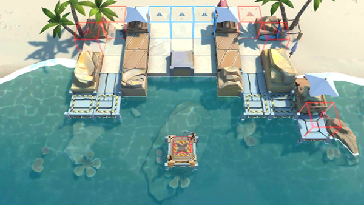

# 关卡一览————悖论模拟_去往高处

## 关卡一览

关卡编号: 悖论模拟_去往高处

关卡名称: 去往高处

目标点生命值: 1

敌人总数: 93

理智消耗: 0

## 关卡地图

## 敌人情况

| 敌人图片 | 敌人名称 | 数量  |
|---------|-----|-----|
| ./eneIcons/eneIcons/¸»ÓªÑøµÄ»¬¶¯Õß.png| 富营养的滑动者  |   40  |
| ./eneIcons/eneIcons/¸»ÓªÑøµÄÅçÍÂÕß.png| 富营养的喷吐者  |   36  |
| ./eneIcons/eneIcons/ÂëÍ·Ë®ÊÖ³¤.png| 码头水手长  |   4  |
| ./eneIcons/eneIcons/Ë®ÊÖ³¤ÖØͧ.png| 水手长重艇  |   3  |
| ./eneIcons/eneIcons/ÌúÕèBÐÍ.png| 铁砧B型  |   0  |
| ./eneIcons/eneIcons/Õ½Êõ·ÀÓùÕß×鳤.png| 战术防御者组长  |   10  |
