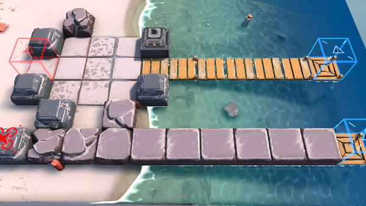

# 关卡一览————悖论模拟_告别软弱

## 关卡一览

关卡编号: 悖论模拟_告别软弱

关卡名称: 告别软弱

目标点生命值: 1

敌人总数: 84

理智消耗: 0

## 关卡地图

## 敌人情况

| 敌人图片 | 敌人名称 | 数量  |
|---------|-----|-----|
| ./eneIcons/eneIcons/Ñý¹Ö.png| 妖怪  |   6  |
| ./eneIcons/eneIcons/Դʯ³æ.png| 源石虫  |   78  |
