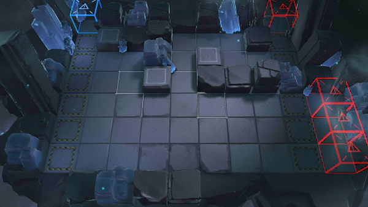

# 关卡一览————悖论模拟_哈！一线贯通！

## 关卡一览

关卡编号: 悖论模拟_哈！一线贯通！

关卡名称: 哈！一线贯通！

目标点生命值: 1

敌人总数: 58

理智消耗: 0

## 关卡地图

## 敌人情况

| 敌人图片 | 敌人名称 | 数量  |
|---------|-----|-----|
| ./eneIcons/eneIcons/²½±ø.png| 步兵  |   19  |
| ./eneIcons/eneIcons/²½±ø×鳤.png| 步兵组长  |   18  |
| ./eneIcons/eneIcons/¸ßÄÜԴʯ³æ.png| 高能源石虫  |   6  |
| ./eneIcons/eneIcons/ÅÍз.png| 磐蟹  |   3  |
| ./eneIcons/eneIcons/Դʯ³æ.png| 源石虫  |   6  |
| ./eneIcons/eneIcons/Դʯ³æ¡¤¦Á.png| 源石虫·α  |   3  |
| ./eneIcons/eneIcons/Դʯ³æ¡¤¦Â.png| 源石虫·β  |   3  |
