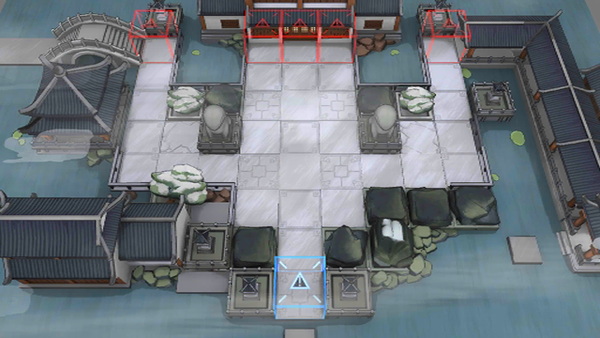

# 关卡一览————悖论模拟_喷射！

## 关卡一览

关卡编号: 悖论模拟_喷射！

关卡名称: 喷射！

目标点生命值: 1

敌人总数: 26

理智消耗: 0

## 关卡地图

## 敌人情况

| 敌人图片 | 敌人名称 | 数量  |
|---------|-----|-----|
| ./eneIcons/eneIcons/¡°°¢Ò§¡±.png| “阿咬”  |   7  |
| ./eneIcons/eneIcons/¡°µÃÒ⡱.png| “得意”  |   19  |
