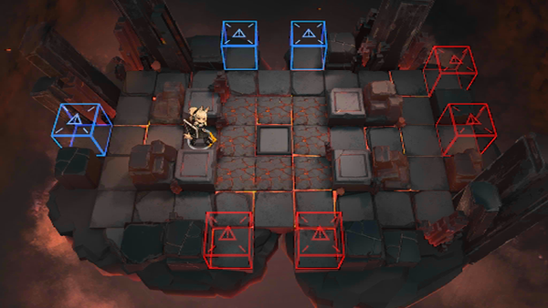

# 关卡一览————悖论模拟_因地制宜

## 关卡一览

关卡编号: 悖论模拟_因地制宜

关卡名称: 因地制宜

目标点生命值: 1

敌人总数: 68

理智消耗: 0

## 关卡地图

## 敌人情况

| 敌人图片 | 敌人名称 | 数量  |
|---------|-----|-----|
| ./eneIcons/eneIcons/·ÛËé¹¥¼áÊÖ.png| 粉碎攻坚手  |   2  |
| ./eneIcons/eneIcons/Èø¿¨×È´©´ÌÊÖ×鳤.png| 萨卡兹穿刺手组长  |   2  |
| ./eneIcons/eneIcons/Ê¿±ø.png| 士兵  |   64  |
