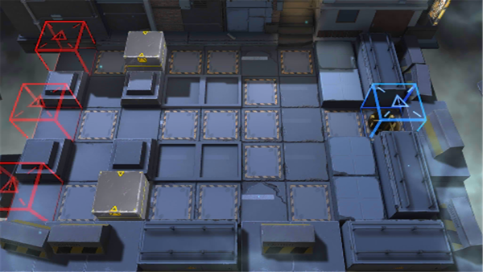

# 关卡一览————悖论模拟_坚守

## 关卡一览

关卡编号: 悖论模拟_坚守

关卡名称: 坚守

目标点生命值: 1

敌人总数: 50

理智消耗: 0

## 关卡地图

## 敌人情况

| 敌人图片 | 敌人名称 | 数量  |
|---------|-----|-----|
| ./eneIcons/eneIcons/²½±ø.png| 步兵  |   24  |
| ./eneIcons/eneIcons/¹¤ÒÏ.png| 工蚁  |   2  |
| ./eneIcons/eneIcons/¹¤ÒÏ×鳤.png| 工蚁组长  |   7  |
| ./eneIcons/eneIcons/»ú¶¯ÎÀ±ø×鳤.png| 机动卫兵组长  |   7  |
| ./eneIcons/eneIcons/Ìع¤.png| 特工  |   10  |
