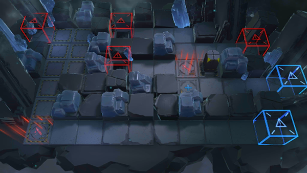

# 关卡一览————悖论模拟_处世之道

## 关卡一览

关卡编号: 悖论模拟_处世之道

关卡名称: 处世之道

目标点生命值: 1

敌人总数: 12

理智消耗: 0

## 关卡地图

## 敌人情况

| 敌人图片 | 敌人名称 | 数量  |
|---------|-----|-----|
| ./eneIcons/eneIcons/¾«ÈñÎ÷Î÷ÀïÈË.png| 精锐西西里人  |   9  |
| ./eneIcons/eneIcons/¿ñͽ.png| 狂徒  |   1  |
| ./eneIcons/eneIcons/Èø¿¨×È´©´ÌÊÖ×鳤.png| 萨卡兹穿刺手组长  |   1  |
| ./eneIcons/eneIcons/Èø¿¨×ÈÊõʦ.png| 萨卡兹术师  |   1  |
