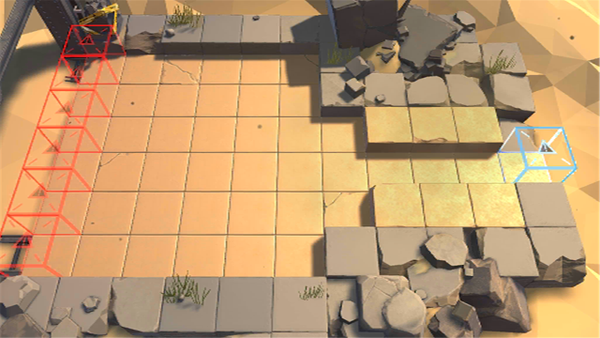

# 关卡一览————悖论模拟_如雷坚守

## 关卡一览

关卡编号: 悖论模拟_如雷坚守

关卡名称: 如雷坚守

目标点生命值: 1

敌人总数: 46

理智消耗: 0

## 关卡地图

## 敌人情况

| 敌人图片 | 敌人名称 | 数量  |
|---------|-----|-----|
| ./eneIcons/eneIcons/±©ÂÒ·Ö×Ó.png| 暴乱分子  |   22  |
| ./eneIcons/eneIcons/»ú¶¯¶Ü×鳤.png| 机动盾组长  |   17  |
| ./eneIcons/eneIcons/ÍÀ·ò.png| 屠夫  |   2  |
| ./eneIcons/eneIcons/ÖØ×°·ÀÓùÕß.png| 重装防御者  |   5  |
