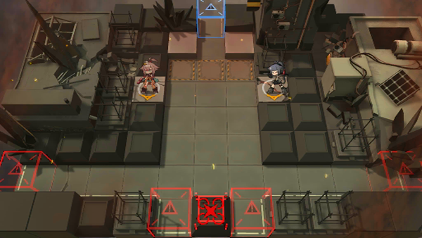

# 关卡一览————悖论模拟_岿然不动

## 关卡一览

关卡编号: 悖论模拟_岿然不动

关卡名称: 岿然不动

目标点生命值: 1

敌人总数: 40

理智消耗: 0

## 关卡地图

## 敌人情况

| 敌人图片 | 敌人名称 | 数量  |
|---------|-----|-----|
| ./eneIcons/eneIcons/·¨Êõ´óʦA2.png| 法术大师A2  |   8  |
| ./eneIcons/eneIcons/Èø¿¨×Èħ½£Ê¿×鳤.png| 萨卡兹魔剑士组长  |   6  |
| ./eneIcons/eneIcons/Êõʦ×鳤.png| 术师组长  |   31  |
