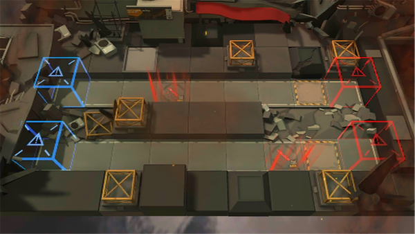

# 关卡一览————悖论模拟_急救

## 关卡一览

关卡编号: 悖论模拟_急救

关卡名称: 急救

目标点生命值: 1

敌人总数: 20

理智消耗: 0

## 关卡地图

## 敌人情况

| 敌人图片 | 敌人名称 | 数量  |
|---------|-----|-----|
| ./eneIcons/eneIcons/åóÊÖ×鳤.png| 弩手组长  |   7  |
| ./eneIcons/eneIcons/Çá¼×ÎÀ±ø.png| 轻甲卫兵  |   12  |
| ./eneIcons/eneIcons/Èø¿¨×È°Ù·ò³¤.png| 萨卡兹百夫长  |   1  |
