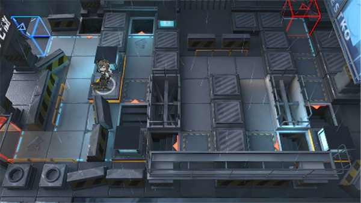

# 关卡一览————悖论模拟_愉快合作

## 关卡一览

关卡编号: 悖论模拟_愉快合作

关卡名称: 愉快合作

目标点生命值: 1

敌人总数: 27

理智消耗: 0

## 关卡地图

## 敌人情况

| 敌人图片 | 敌人名称 | 数量  |
|---------|-----|-----|
| ./eneIcons/eneIcons/Ê¿±ø.png| 士兵  |   26  |
| ./eneIcons/eneIcons/ß±¾ýÕß.png| 弑君者  |   1  |
