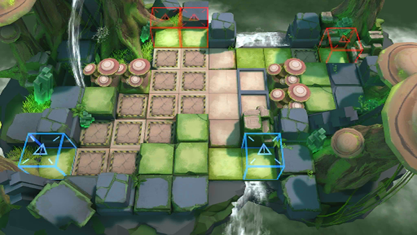

# 关卡一览————悖论模拟_战力增强剂

## 关卡一览

关卡编号: 悖论模拟_战力增强剂

关卡名称: 战力增强剂

目标点生命值: 1

敌人总数: 86

理智消耗: 0

## 关卡地图

## 敌人情况

| 敌人图片 | 敌人名称 | 数量  |
|---------|-----|-----|
| ./eneIcons/eneIcons/ÌáÑÇ¿¨ÎÚºÃÕ½Õß.png| 提亚卡乌好战者  |   4  |
| ./eneIcons/eneIcons/ÌáÑÇ¿¨ÎÚսʿ.png| 提亚卡乌战士  |   10  |
| ./eneIcons/eneIcons/Դʯ³æ.png| 源石虫  |   40  |
| ./eneIcons/eneIcons/Դʯ³æ¡¤¦Á.png| 源石虫·α  |   32  |
