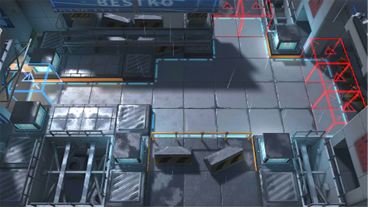

# 关卡一览————悖论模拟_战场烹调师

## 关卡一览

关卡编号: 悖论模拟_战场烹调师

关卡名称: 战场烹调师

目标点生命值: 1

敌人总数: 37

理智消耗: 0

## 关卡地图

## 敌人情况

| 敌人图片 | 敌人名称 | 数量  |
|---------|-----|-----|
| ./eneIcons/eneIcons/¸ß½×Êõʦ.png| 高阶术师  |   2  |
| ./eneIcons/eneIcons/¼¦Î²¾ÆͶÖÀÕß.png| 鸡尾酒投掷者  |   15  |
| ./eneIcons/eneIcons/¿ñ±©ËÞÖ÷Ê¿±ø.png| 狂暴宿主士兵  |   1  |
| ./eneIcons/eneIcons/ÅÚÊÖ.png| 炮手  |   1  |
| ./eneIcons/eneIcons/ËÞÖ÷Ê°»ÄÕß.png| 宿主拾荒者  |   18  |
