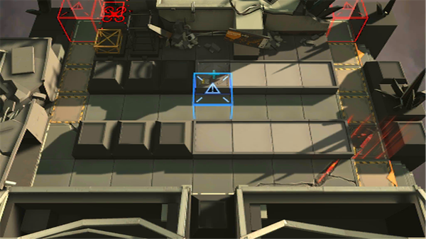

# 关卡一览————悖论模拟_战战兢兢

## 关卡一览

关卡编号: 悖论模拟_战战兢兢

关卡名称: 战战兢兢

目标点生命值: 1

敌人总数: 19

理智消耗: 0

## 关卡地图

## 敌人情况

| 敌人图片 | 敌人名称 | 数量  |
|---------|-----|-----|
| ./eneIcons/eneIcons/·¨Êõ´óʦA1.png| 法术大师A1  |   5  |
| ./eneIcons/eneIcons/DZ·üÕß.png| 潜伏者  |   4  |
| ./eneIcons/eneIcons/Èø¿¨×È´©´ÌÊÖ×鳤.png| 萨卡兹穿刺手组长  |   1  |
| ./eneIcons/eneIcons/Èø¿¨×ÈÊõʦ.png| 萨卡兹术师  |   3  |
| ./eneIcons/eneIcons/Ñý¹Ö.png| 妖怪  |   4  |
| ./eneIcons/eneIcons/ÔÞÖúÎÞÈË»ú.png| 赞助无人机  |   2  |
