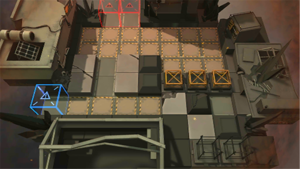

# 关卡一览————悖论模拟_打坏人的诀窍

## 关卡一览

关卡编号: 悖论模拟_打坏人的诀窍

关卡名称: 打坏人的诀窍

目标点生命值: 1

敌人总数: 25

理智消耗: 0

## 关卡地图

## 敌人情况

| 敌人图片 | 敌人名称 | 数量  |
|---------|-----|-----|
| ./eneIcons/eneIcons/¸ßÄÜԴʯ³æ¡¤¦Á.png| 高能源石虫·α  |   8  |
| ./eneIcons/eneIcons/Èø¿¨×ÈÊõʦ.png| 萨卡兹术师  |   2  |
| ./eneIcons/eneIcons/Óλ÷¶Ó¶ÜÎÀ.png| 游击队盾卫  |   2  |
| ./eneIcons/eneIcons/Óλ÷¶Óսʿ.png| 游击队战士  |   12  |
| ./eneIcons/eneIcons/ÔÞÖúÎÞÈË»ú.png| 赞助无人机  |   1  |
