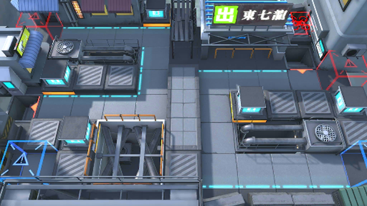

# 关卡一览————悖论模拟_拉特兰风格

## 关卡一览

关卡编号: 悖论模拟_拉特兰风格

关卡名称: 拉特兰风格

目标点生命值: 1

敌人总数: 34

理智消耗: 0

## 关卡地图

## 敌人情况

| 敌人图片 | 敌人名称 | 数量  |
|---------|-----|-----|
| ./eneIcons/eneIcons/¶¬ÁéѪÎ×´óʦ.png| 冬灵血巫大师  |   1  |
| ./eneIcons/eneIcons/·¨Êõ½üÎÀ.png| 法术近卫  |   6  |
| ./eneIcons/eneIcons/ËÞÖ÷Ê¿±ø.png| 宿主士兵  |   6  |
| ./eneIcons/eneIcons/ÌØսʿ±ø.png| 特战士兵  |   7  |
| ./eneIcons/eneIcons/Ñý¹ÖMKII.png| 妖怪MKII  |   13  |
| ./eneIcons/eneIcons/ÔÞÖúÎÞÈË»ú.png| 赞助无人机  |   1  |
