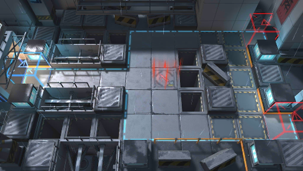

# 关卡一览————悖论模拟_拳风拂面

## 关卡一览

关卡编号: 悖论模拟_拳风拂面

关卡名称: 拳风拂面

目标点生命值: 1

敌人总数: 21

理智消耗: 0

## 关卡地图

## 敌人情况

| 敌人图片 | 敌人名称 | 数量  |
|---------|-----|-----|
| ./eneIcons/eneIcons/·ÛËé¹¥¼á×鳤.png| 粉碎攻坚组长  |   3  |
| ./eneIcons/eneIcons/¿ñ±©ËÞÖ÷Ê¿±ø.png| 狂暴宿主士兵  |   6  |
| ./eneIcons/eneIcons/¿ñ±©ËÞÖ÷ͶÖÀÊÖ.png| 狂暴宿主投掷手  |   4  |
| ./eneIcons/eneIcons/ËÞÖ÷Ê¿±ø.png| 宿主士兵  |   8  |
