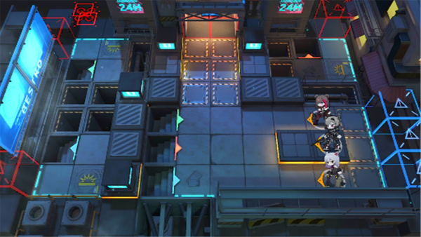

# 关卡一览————悖论模拟_控局

## 关卡一览

关卡编号: 悖论模拟_控局

关卡名称: 控局

目标点生命值: 1

敌人总数: 57

理智消耗: 0

## 关卡地图

## 敌人情况

| 敌人图片 | 敌人名称 | 数量  |
|---------|-----|-----|
| ./eneIcons/eneIcons/±©û_¡¤G.png| 暴鸰·G  |   3  |
| ./eneIcons/eneIcons/¸ßÄÜԴʯ³æ.png| 高能源石虫  |   1  |
| ./eneIcons/eneIcons/¸ßÄÜԴʯ³æ¡¤¦Á.png| 高能源石虫·α  |   2  |
| ./eneIcons/eneIcons/¿ñ±©ËÞÖ÷×鳤.png| 狂暴宿主组长  |   2  |
| ./eneIcons/eneIcons/Ê¿±ø.png| 士兵  |   8  |
| ./eneIcons/eneIcons/ÌØսʿ±ø.png| 特战士兵  |   35  |
| ./eneIcons/eneIcons/ÓÄÁé.png| 幽灵  |   6  |
