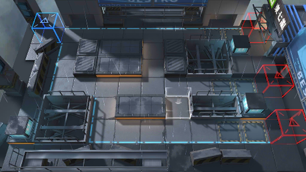

# 关卡一览————悖论模拟_攻守兼备

## 关卡一览

关卡编号: 悖论模拟_攻守兼备

关卡名称: 攻守兼备

目标点生命值: 1

敌人总数: 33

理智消耗: 0

## 关卡地图

## 敌人情况

| 敌人图片 | 敌人名称 | 数量  |
|---------|-----|-----|
| ./eneIcons/eneIcons/¿ñ±©ËÞÖ÷ͶÖÀÊÖ.png| 狂暴宿主投掷手  |   11  |
| ./eneIcons/eneIcons/Ëé¹Ç.png| 碎骨  |   1  |
| ./eneIcons/eneIcons/ÌØÕ½Êõʦ.png| 特战术师  |   7  |
| ./eneIcons/eneIcons/ÖØ×°·ÀÓùÕß.png| 重装防御者  |   14  |
