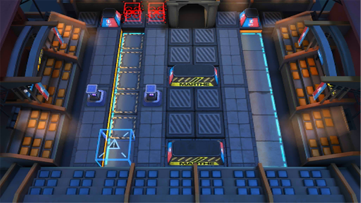

# 关卡一览————悖论模拟_无人机筛选

## 关卡一览

关卡编号: 悖论模拟_无人机筛选

关卡名称: 无人机筛选

目标点生命值: 1

敌人总数: 22

理智消耗: 0

## 关卡地图

## 敌人情况

| 敌人图片 | 敌人名称 | 数量  |
|---------|-----|-----|
| ./eneIcons/eneIcons/µÛ¹úÅÚ»ðÏÈÕ×Õß.png| 帝国炮火先兆者  |   3  |
| ./eneIcons/eneIcons/·¨Êõ´óʦA2.png| 法术大师A2  |   7  |
| ./eneIcons/eneIcons/º®Ëª.png| 寒霜  |   1  |
| ./eneIcons/eneIcons/ºÀ»ªÔÞÖúÎÞÈË»ú.png| 豪华赞助无人机  |   1  |
| ./eneIcons/eneIcons/Ñý¹ÖMKII.png| 妖怪MKII  |   6  |
| ./eneIcons/eneIcons/ÔÞÖúÎÞÈË»ú.png| 赞助无人机  |   4  |
