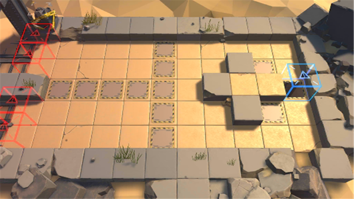

# 关卡一览————悖论模拟_最佳视野

## 关卡一览

关卡编号: 悖论模拟_最佳视野

关卡名称: 最佳视野

目标点生命值: 1

敌人总数: 27

理智消耗: 0

## 关卡地图

## 敌人情况

| 敌人图片 | 敌人名称 | 数量  |
|---------|-----|-----|
| ./eneIcons/eneIcons/¸ß½×Êõʦ.png| 高阶术师  |   6  |
| ./eneIcons/eneIcons/ß±¾ýÕß.png| 弑君者  |   1  |
| ./eneIcons/eneIcons/Êõʦ.png| 术师  |   4  |
| ./eneIcons/eneIcons/Êõʦ×鳤.png| 术师组长  |   16  |
