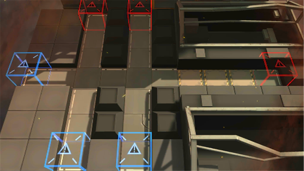

# 关卡一览————悖论模拟_月夜魔王之剑

## 关卡一览

关卡编号: 悖论模拟_月夜魔王之剑

关卡名称: 月夜魔王之剑

目标点生命值: 1

敌人总数: 22

理智消耗: 0

## 关卡地图

## 敌人情况

| 敌人图片 | 敌人名称 | 数量  |
|---------|-----|-----|
| ./eneIcons/eneIcons/Çá¼×ÎÀ±ø.png| 轻甲卫兵  |   6  |
| ./eneIcons/eneIcons/Ë«³Ö½£Ê¿.png| 双持剑士  |   15  |
| ./eneIcons/eneIcons/ÖØ×°·ÀÓùÕß.png| 重装防御者  |   1  |
