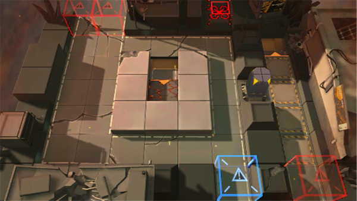

# 关卡一览————悖论模拟_模拟场景1122K

## 关卡一览

关卡编号: 悖论模拟_模拟场景1122K

关卡名称: 模拟场景1122K

目标点生命值: 1

敌人总数: 37

理智消耗: 0

## 关卡地图

## 敌人情况

| 敌人图片 | 敌人名称 | 数量  |
|---------|-----|-----|
| ./eneIcons/eneIcons/¸ßÄÜԴʯ³æ¡¤¦Á.png| 高能源石虫·α  |   14  |
| ./eneIcons/eneIcons/Çá¼×ÎÀ±ø.png| 轻甲卫兵  |   9  |
| ./eneIcons/eneIcons/Ñý¹ÖMKII.png| 妖怪MKII  |   8  |
| ./eneIcons/eneIcons/ÖØ×°·ÀÓù×鳤.png| 重装防御组长  |   6  |
