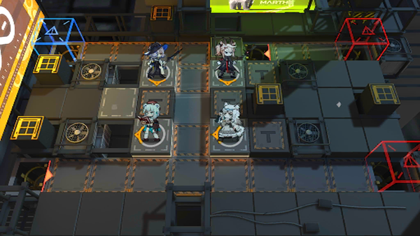

# 关卡一览————悖论模拟_炮与弩的包围网

## 关卡一览

关卡编号: 悖论模拟_炮与弩的包围网

关卡名称: 炮与弩的包围网

目标点生命值: 1

敌人总数: 11

理智消耗: 0

## 关卡地图

## 敌人情况

| 敌人图片 | 敌人名称 | 数量  |
|---------|-----|-----|
| ./eneIcons/eneIcons/¸¡Ê¿µÂ.png| 浮士德  |   1  |
| ./eneIcons/eneIcons/ÅÚÊÖ.png| 炮手  |   3  |
| ./eneIcons/eneIcons/Ñ©¹ÖС¶Ó.png| 雪怪小队  |   7  |
