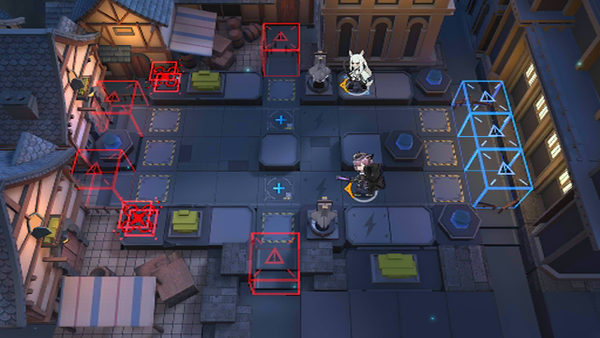

# 关卡一览————悖论模拟_牢不可破的幻影

## 关卡一览

关卡编号: 悖论模拟_牢不可破的幻影

关卡名称: 牢不可破的幻影

目标点生命值: 1

敌人总数: 64

理智消耗: 0

## 关卡地图

## 敌人情况

| 敌人图片 | 敌人名称 | 数量  |
|---------|-----|-----|
| ./eneIcons/eneIcons/·¨Êõ´óʦA2.png| 法术大师A2  |   12  |
| ./eneIcons/eneIcons/À³ËþÄáÑÇÅѱø×鳤.png| 莱塔尼亚叛兵组长  |   28  |
| ./eneIcons/eneIcons/À³ËþÄáÑÇÒ÷³ªÕß.png| 莱塔尼亚吟唱者  |   6  |
| ./eneIcons/eneIcons/ÄàÑÒ¾ÞÏñ.png| 泥岩巨像  |   2  |
| ./eneIcons/eneIcons/ÌØÕ½Êõʦ×鳤.png| 特战术师组长  |   16  |
