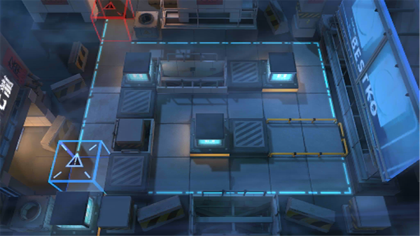

# 关卡一览————悖论模拟_独行者的合谋

## 关卡一览

关卡编号: 悖论模拟_独行者的合谋

关卡名称: 独行者的合谋

目标点生命值: 1

敌人总数: 35

理智消耗: 0

## 关卡地图

## 敌人情况

| 敌人图片 | 敌人名称 | 数量  |
|---------|-----|-----|
| ./eneIcons/eneIcons/Çá¼×ÎÀ±ø.png| 轻甲卫兵  |   6  |
| ./eneIcons/eneIcons/ÌØÕ½Êõʦ×鳤.png| 特战术师组长  |   5  |
| ./eneIcons/eneIcons/Դʯ³æ¡¤¦Á.png| 源石虫·α  |   24  |
