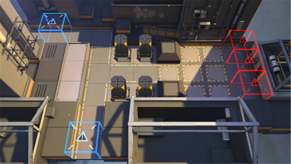

# 关卡一览————悖论模拟_生还者

## 关卡一览

关卡编号: 悖论模拟_生还者

关卡名称: 生还者

目标点生命值: 1

敌人总数: 43

理智消耗: 0

## 关卡地图

## 敌人情况

| 敌人图片 | 敌人名称 | 数量  |
|---------|-----|-----|
| ./eneIcons/eneIcons/±©û_.png| 暴鸰  |   3  |
| ./eneIcons/eneIcons/»ú¶¯¶Ü±ø.png| 机动盾兵  |   23  |
| ./eneIcons/eneIcons/»ú¶¯¶Ü×鳤.png| 机动盾组长  |   5  |
| ./eneIcons/eneIcons/Դʯ³æ.png| 源石虫  |   12  |
